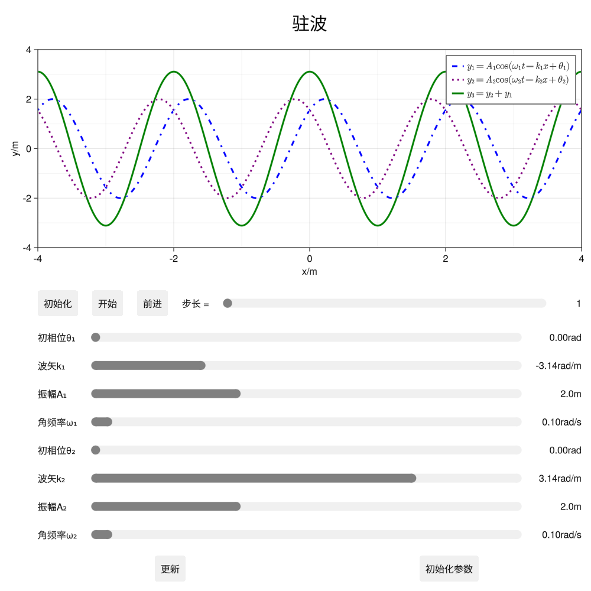

# PhysicsEducation

[](https://wwangnju.github.io/PhysicsEducation.jl/stable/)
[](https://wwangnju.github.io/PhysicsEducation.jl/dev/)
[](https://github.com/wwangnju/PhysicsEducation.jl/actions/workflows/CI.yml?query=branch%3Amaster)
[](https://codecov.io/gh/wwangnju/PhysicsEducation.jl)

## 安装
In Julia, please type `]` in the REPL to use the package mode, then type this command:

```julia
pkg> add https://github.com/wwangnju/PhysicsEucation.jl
```

## 例子
在examples目录中，实现了光栅夫琅和费衍射、圆孔夫琅和费衍射、简谐振动、受迫振动、牛顿环、双缝干涉、驻波以及正多边形夫琅和费衍射的可交互式动态模拟。

